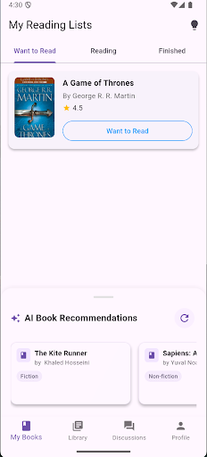
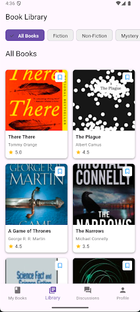
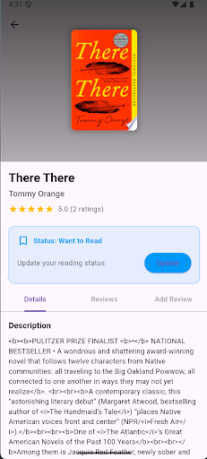
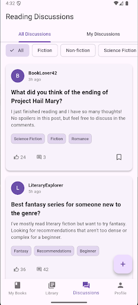
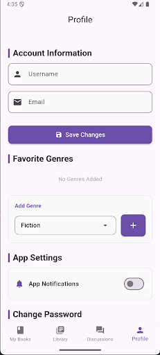

# 📚 AI-Powered Book Recommendation & Review App

A comprehensive mobile app designed for book lovers that combines AI-driven book recommendations, review management, and community interaction. Built using Flutter, Firebase, and Google Books API, this project enhances book discovery and creates a vibrant reading community.

---

## 👩‍💻 Built By

**Ruhi Sawant** and **Saiesh Irukulla**  
A collaborative project to explore the intersection of mobile app development, AI integration, and community-driven features in the context of literature.

---

## ✨ Features

### 🔐 User Authentication & Profile Management
- Secure login/signup system using Firebase
- Personalized user profiles
- Set and update genre preferences
- Manage accounts with password resets and email updates

### 🔍 Book Discovery & Search
- Search by title, author, or genre
- AI-powered recommendations via Cohere based on user preferences
- Integration with Google Books API for real-time metadata
- View book summaries, author details, ratings, and publication data

### 📖 Reading Management
- Create and manage reading lists: *Want to Read*, *Currently Reading*, *Finished*
- Update reading progress and status
- Sort/filter lists based on author, rating, status, or date
- Clean and intuitive UI to keep track of your reading journey

### ✍️ Review System
- Write, edit, and delete personal book reviews
- Rate books on a 1–5 star scale
- View other users' reviews
- AI-generated review summaries highlight key sentiments across reviews

### 💬 Community Engagement
- Join discussion boards by genre, book, or trending topics
- Create and reply to threads
- Upvote, comment, and interact with fellow readers
- Share reading milestones and recommendations

### 🤖 AI-Powered Features
- Personalized recommendations with **Cohere NLP API**
- Book data enriched using **Google Books API**
- Seamless login & storage with **Firebase Authentication & Firestore**

---

## 🛠️ Tech Stack

- **Frontend:** Flutter (Dart)
- **Backend/Database:** Firebase (Auth, Firestore)
- **AI Services:** Cohere API
- **APIs Used:** Google Books API
- **Version Control:** Git & GitHub
- **Tools:** Firebase CLI, Android Studio, Visual Studio Code

---

## 🚀 Installation

Follow these steps to run the app locally:

1. **Clone the repository:**
   ```bash
   git clone https://github.com/Ruhisawant/The-Book-Club.git
   cd the-book-club
   ````

2. **Install dependencies:**

   ```bash
   flutter pub get
   ```

3. **Set up Firebase:**

   * Add your `google-services.json` (for Android) in `android/app/`
   * Or `GoogleService-Info.plist` (for iOS) in `ios/Runner/`
   * Enable Authentication and Firestore in the Firebase Console

4. **Run the app:**

   ```bash
   flutter run
   ```

> ✅ Make sure you have Flutter SDK installed. If not, follow the [Flutter installation guide](https://flutter.dev/docs/get-started/install).

---

## 📸 Screenshots

| Login/SignUp               | Home                     | Library                        |
| -------------------------- | ------------------------ | ------------------------------ |
|  |  |  |

| Book Details                        | Discussion Board                     | Profile Settings                 |
| ----------------------------------- | ------------------------------------ | -------------------------------- |
|  |  |  |

---

## 📄 License

This project is licensed under the **MIT License** – see the [LICENSE](LICENSE) file for details.

---

## 🙌 Acknowledgements

* [Flutter](https://flutter.dev/)
* [Firebase](https://firebase.google.com/)
* [Google Books API](https://developers.google.com/books)
* [Cohere](https://cohere.ai/)
